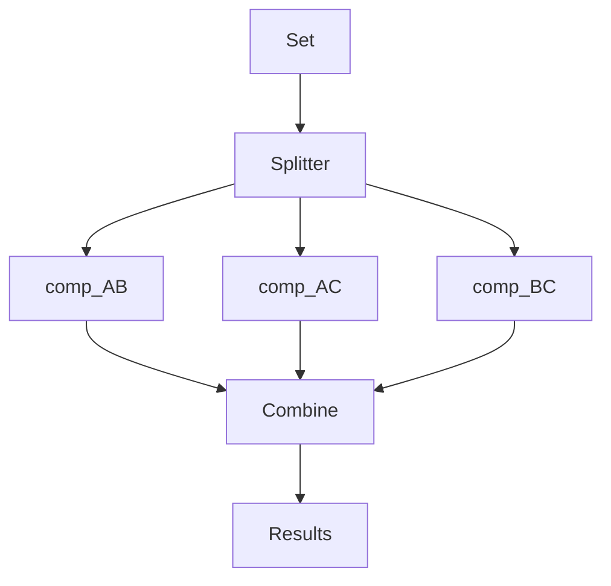
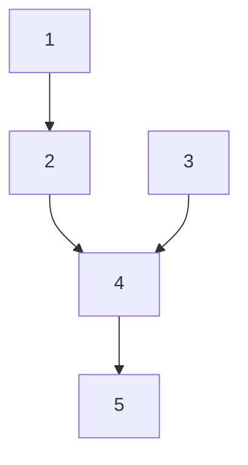
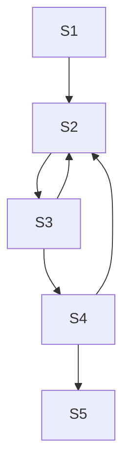
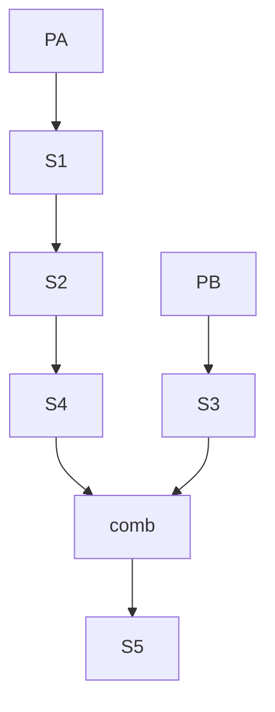
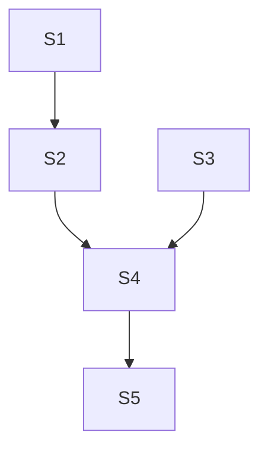

# Collaborative Document Parallel Python Day 1

2022-10-10 Parallel Python.

Welcome to The Workshop Collaborative Document.

This Document is synchronized as you type, so that everyone viewing this page sees the same text. This allows you to collaborate seamlessly on documents.


## 👮Code of Conduct

Participants are expected to follow these guidelines:
* Use welcoming and inclusive language.
* Be respectful of different viewpoints and experiences.
* Gracefully accept constructive criticism.
* Focus on what is best for the community.
* Show courtesy and respect towards other community members.

## ⚖️ License

All content is publicly available under the Creative Commons Attribution License: [creativecommons.org/licenses/by/4.0/](https://creativecommons.org/licenses/by/4.0/).

## 🙋Getting help

To ask a question, just raise your hand.

If you need help from a helper, place an **orange** post-it note on your laptop lid. A helper will come to assist you as soon as possible.

## 🖥 Workshop website

[link](https://esciencecenter-digital-skills.github.io/2022-10-10-ds-parallel/)

🛠 Setup

[link](https://esciencecenter-digital-skills.github.io/2022-10-10-ds-parallel/#software-setup)

Download files

[link](https://github.com/esciencecenter-digital-skills/parallel-python-workshop.git)

## 🗓️ Agenda
| Time | Topic |
|--:|:---|
|09:30|	Welcome and icebreaker|
|09:45|	Introduction|
|10:30|	Break|
|10:40|	Measuring performance|
|11:30|	Break|
|11:40|	Parallelization using Dask Arrays|
|12:30|	Lunch Break|
|13:30|	Accelerate code using Numba|
|14:30|	Break|
|14:40|	Delayed evaluation with Dask|
|15:30|	Break|
|15:40|	Threads and Processes in Python|
|16:15|	Wrap-up|
|16:30|	END|

## 🏢 Location logistics
* Coffee and toilets are in the hallway, just outside of the classroom.
* If you leave the building,
  be sure to be accompanied by someone from the eScience Center to let you back in through the ground floor door
* For access to this floor you might need to ring the doorbell so someone can let you in
* In case of an emergency, you can exit our floor using the main staircase.
  Or follow green light signs at the ceiling to the emergency staircase.
* **Wifi**: Eduroam should work. Otherwise use the 'matrixbuilding' network, password should be printed out and available somewhere in the room.
* Photography

## 🔧 Exercises
### Introduction
#### Exercise 1: Parallellizable and non-parallellizable tasks
Can you think of a task in your domain that is parallelizable? Can you also think of one that is fundamentally
non-parallelizable? Write down your answers:
* Alok:
Parallelizable task -> Applying n independent symmetry operation on a 3D array
Non-parallelizable task -> Calculating the FFT of a N-D array
* Carsten: parallelizable: calculate noise emission of roads (lines) in a GIS application | not parallelizable: any iterative algorithm
* Daphne: Optimization problems, evaluating different structures / partial or ordinary differential equations depending on time or space
* Davide: Parallelizable: single cell analysis / Not parallelizable:Recurrent network dynamic symulations
* Eva: yes: Weather forecast verification, no: numerical weather prediction
* Gaby: calculate streamflow for different sub-basins | assimliate data for each timestep
* Irene: Parallelizable: Fetching large volumes of climate data and performing an operation. Non-parallelizable: real-time value imputation of weather time-series
* Kevin:
Idea: Convert technical drawings to a text string and use this to compaire them. For This we need to compaire each string to find a pattern.
We prop. can do the compairing part of string A and B and B and C parralel to each other, but the compairing part it self not.



* Marlein: parallelizable: output of (large-scale, parallelized) numerical models that needs to be post-processed in the same way / non-parallelizable: ?
* Kutay: Recurrent NNs (LSTMs, GRUs, etc.) are not parallelizable. Applying Monte Carlo samples to NNs should be parallelizable.
* Lieke: Hyperparameter tuning with a grid search / Fitting a curve through a dataset
* Maarten: Parallelisable: running multiple molecular dynamics replica's, doing analysis computations of dynamics quantities / Not parallelisable: running multiple integration steps
* Max: not parallelisable: web api calls (rate limit dependend), parallelisable: ETL pipelines
* Nanda Kishor: Non Parallelizable- receeding horizon optimisation, Parallelizable- Quasi dynamic power flow
* Shuxin: parallelizable - subset of knowledge gragh for quality assessment; non-parallelizable: parallel different assessment steps due to dependency
* Tim: Calculating distances between atoms
* Victoria: par: routing streamflow through subbasins and combining results; non-par: time series calculations dependent on antecedent moisture conditions

#### Exercise 2: Parallelised Pea Soup

We have the following recipe:
1. (1 min) Pour water into a soup pan, add the split peas and bay leaf and bring it to boil.
2. (60 min) Remove any foam using a skimmer and let it simmer under a lid for about 60 minutes.
3. (15 min) Clean and chop the leek, celeriac, onion, carrot and potato.
4. (20 min) Remove the bay leaf, add the vegetables and simmer for 20 more minutes. Stir the soup occasionally.
5. (1 day) Leave the soup for one day. Reheat before serving and add a sliced smoked sausage (vegetarian options are also welcome). Season with pepper and salt.

Imagine you're cooking alone.
- Can you identify potential for parallelisation in this recipe?
- And what if you are cooking with the help of a friend? Is the soup done any faster?
- Draw a dependency diagram.

* Alok:
[cooking alone]

(1) -> (2) -> (4) -> (5)
       (3) -> -^
[with a friend]
Me: (1) -> (2)
Friend: (3) -> (4) -> (5)
No, the soup is not done faster because the time limiting steps are just waiting (while boiling and then to leave it for a day)

* Carsten:
Split: (Task 1 & 2), (3.1(leak)), (3.2(celeriac)), (3.3...)
wait & collect
in serial: Task 4 and 5

* Daphne:
step 3 can be done while doing step 2 as well.
1 -> 2 -> 4 -> 5
 --->          3 -> ^
no, the soup is not done faster
* Davide:
1 -> 2 -> 4 -> 5
     3 -> 4
     Task 2 and 3 can be done at the same time, with just one person. Adding a friend does not make the recepie faster.
* Eva: alone: 1 --> while 2 do (3 --> 4) --> 5, together: person 1: (1 --> 2), person 2 at the same time: (3 --> 4), when both done: --> 5. not faster
* Gaby: alone: 1 -> 2 & 3 -> 4 -> 5

* Irene:

[alone]
1 -> 2 -> wait for 4
3 -> 4 -> 5

[friend]
Same thing; not faster.


* Kevin:

#### Alone :-1:


#### With friends :+1:



* Kutay: Vegetables can be chopped (step 3) during simmering (step 2). It saves 15 minutes. I can do this by myself. Another friend is redundant I guess.
* Lieke: S1 -> S2 -> S4 -> S5, S3 -> S4
Only S3 is independent of earlier steps.
Help doesnt speed up the process of cooking!
* Maarten: (alone):
    1>2>4>5
      3>4
          (together):
      friend : 1>2>3>4>5
      me : :)
* Marlein: (alone) step 1 --> step 2 --> while step 2, do step 3 --> step 4 --> step 5 (with friend) friend does step 1 and 2 while you do step 3 (chopping). Then 4 and 5.
* Max:
    * alone
        *  1 -> 2
        *  3
        *  2/3 -> 4 -> 5
    *  with friends
        *  friend1: 1 -> 2
        *  friend2: 3
        *  2/3 -> 4 -> 5
* Nanda


* Shuxin:
If alone:
step 3 (option in step 5) can be parallel;
1 -> 2 -> 4 -> 5
3 ->

If with friends:
Not faster

* Tim:
step 2 and 3 can be done in parallel
Having a friend helping would not speedup the process

* Victoria: alone:1-> 2-> 4->5
                      3->
            with friend:1-> 2->4->5
                        3-> (veggies get chopped 1 min faster, no real advantage)


### Exercise 3: Calc pi exercise
Use only standard Python and the function `random.uniform`. The function should have the following
interface:
~~~python
import random
def calc_pi(N):
"""Computes the value of pi using N random samples."""
...
for i in range(N):
# take a sample
...
return ...
~~~

Also make sure to time your function!

### Exercise 4: Daskify
Write `calc_pi_dask` to make the Numpy version parallel. Compare speed and memory performance with
the Numpy version. NB: Remember that dask.array mimics the numpy API.

### Exercise 5: Numbify `calc_pi`
Create a Numba version of `calc_pi`. Time it.

### Exercise 6: try threading on a Numpy function
Many Numpy functions unlock the GIL. Try to sort 3 randomly generated arrays using `numpy.sort` in parallel.

## 🧠 Collaborative Notes
### 02 Measuring performance
Shortcut turning a code cell into markdown cell:
* press 'Esc'
* press 'M'
```python=
import numpy as np
result = np.arange(10**7).sum()
```
NB: depending on your machine you could use 10**8 or 10**9 to make the computation a bit longer.
Try to not crash your machine :smile_cat:
```python=
import dask.array as da
work = da.arange(10**7).sum()
result = work.compute()
```
Tools for checking resources visually
* mac: `btop` (install: brew install btop)
* windows: CTRL + ALT + DEL --> pick taskmanager
* linux: `top`

Measuring time it takes to run a cell in jupyter notebook:
```python=
%%time
np.arange(10**7).sum()
```

Measuring time it takes to run a cell **several times**:
```python=
%%timeit
np.arange(10**7).sum()
```

Inline measuring time, storing it in a variable:
```python=
time = %timeit -o np.arange(10**7).sum()
```

You can use the resulting TimeitResult object:
```python=
print(f"Time taken: {time.average:.4f}")
```
Getting documentation of time object:
```python=
time?
```
The same thing in dask is much faster:
```python=
%%timeit
da.arange(10**7).sum().compute()
```

#### Memory profiling
Install memory profiler:
```python=
!pip install memory_profiler
```

```python=
from memory_profiler import memory_usage
```
```python=
import numpy as np
import dask.array as da
import matplotlib.pyplot as plt
```
Define functions for our sum operaionts
```python=
def sum_with_numpy():
    np.arange(10**9).sum()

def sum_with_dask():
    da.arange(10**9).sum().compute()
```

Profile memory:
```python=
memory_numpy = memory_usage(sum_with_numpy, interval=0.01)
memory_dask = memory_usage(sum_with_dask, interval=0.01)

# plot results
plt.plot(memory_numpy, label='numpy')
plt.plot(memory_dask, label='dask')
plt.xlabel('Time step')
plt.ylabel('Memory usage (MB)')
plt.legend()
plt.show()
```

How much memory does my numpy array use?
```python=
np.arange(10).itemsize
np.arange(10).nbytes
```

Printing information about how dask will do computation:
```python=
da.arange(10**7).sum()
```
```python=
da.arange(10**7)
```

How many CPUs do I have?
```python=
import psutil
n_physical_cores = psutil.cpu_count(logical=False)
n_logical_cores = psutil.cpu_count(logical=True)
print(f"The number of physical/logical cores is {n_physical_cores}/{n_logical_cores}")
```
**Hyperthreading**: pretending that you have more cores than you physically have.
This is so that the CPU can do 2 tasks at the same time if there is waiting involved.
Often you have 2x more logical cores than physical cores

Visualize how long it takes to compute with different number of workers.
```python=
x = []
for n in range(1, 12): # make 12 a bit larger than the number of logical cores
    time_taken = %timeit -r 1 -o da.arange(10**7).sum().compute(num_workers=n)
    x.append(time_taken.average)
```
```python=
import pandas as pd
data = pd.DataFrame({"n": range(1, 12), "t": x})
data.set_index("n").plot()
```

------
### LUNCH BREAK
------
### Computing pi
```python=
import random
random.uniform(-1, 1)
```

```python=
def calc_pi(N):
    M = 0
    for i in range(N):
        x = random.uniform(-1, 1)
        y = random.uniform(-1, 1)
        dist = x**2 + y**2
        if dist < 1:
            M += 1
    return 4*M/N
```

```python=
%timeit calc_pi(10**6)
```

Let's speed up this function. First we do this without using multiple cores, but by using a faster way of generating all the random numbers.

```python=
import numpy as np
def calc_pi_numpy(N):
    x = np.random.uniform(-1, 1, N)
    y = np.random.uniform(-1, 1, N)
    dist = x**2 + y**2
    M = np.where(dist<1, 1, 0).sum()
    return 4 * M/N

calc_pi_numpy(10**6)
```
Let's measure how fast our numpy implementation is
```python=
%timeit calc_pi_numpy(10**6)
```

Calculating pi with dask:
```python=
import numpy as np
def calc_pi_numpy(N):
    x = da.random.uniform(-1, 1, N)
    y = da.random.uniform(-1, 1, N)
    dist = x**2 + y**2
    M = da.where(dist<1, 1, 0).sum()
    return 4 * M/N
```

Let's time it:
```python=
%timeit calc_pi_dask(10**8).compute()
```

#### Numba
Let's first recap our vanilla python and numpy sum implementations:
```python=
%timeit sum(range(10**7))
```
```python=
%timeit np.arange(10**7).sum()
```
**Just-in-time compiler**: it can compile dynamically during runtime ('on the fly')

`numba` is a just-in-time compiler

Another pure-python implementation
```python=
def sum_range(N):
    sum = 0
    for i in range(N):
        sum += i
    return sum
```
Let's time this:
```python
%timeit sum_range(10**7)
```
Let's now wrap our function in the `numba.jit` decorator
```python=
import numba
@numba.jit
def sum_range(N):
    sum = 0
    for i in range(N):
        sum += i
    return sum
```
Let's time it!
```python
%timeit sum_range_numba(10**7)
```

Numba implementation for calc_pi:
```python=
@numba.jit()
def calc_pi_numba(N):
    M = 0
    for i in range(N):
        x = random.uniform(-1, 1)
        y = random.uniform(-1, 1)
        dist = x**2 + y**2
        if dist < 1:
            M += 1
    return 4 * M/N

# or if you use your old function:
numba.jit(calc_pi_numba)
```
### Multithreading
```python=
from threading import Thread
```
**thread**: Think of it as a task. You can launch it, you can give it arguments, and it will run the task.
```python=
%%timeit
N = 10**6
t1 = Thread(target=calc_pi, args=(N,))
t2 = Thread(target=calc_pi, args=(N,))
t1.start()
t2.start()

# closing statement
t1.join()
t2.join()
```
**global interpreter lock (GIL)** No Python objects can be modified simultaneously!
Because also python functions are objects Python prevents them from running simultaneously.

Let's tell numba to cicrumvent the GIL:
```python=
@numba.jit(nogil=True) # This circumvents the GIL
def calc_pi_numba(N):
    M = 0
    for i in range(N):
        x = random.uniform(-1, 1)
        y = random.uniform(-1, 1)
        dist = x**2 + y**2
        if dist < 1:
            M += 1
    return 4 * M/N
```

Now we can run our numba code multithreaded again:
```python=
%%timeit
N = 10**6
t1 = Thread(target=calc_pi, args=(N,))
t2 = Thread(target=calc_pi, args=(N,))
t1.start()
t2.start()

# closing statement
t1.join()
t2.join()
```
### Why is there a Global Interpreter Lock (GIL)?
```python=
some_list = [1, 3, 8]
def modify_list(a_list):
    a_list[1] = 0

def modification_of_list(list):
    list[1] = 2
```
In the above example, if there is no GIL, and you run both functions in parallel.
You don't know which function runs first. This is called a race-condition.
Having the GIL makes python **thread-safe**
```python=
N = 10**7
rnd_numbers = np.random.random(N)
%timeit np.sort(rnd_numbers)
```

```python=
%%timeit
N = 10**7
rnd1 = np.random.random(N)
rnd2 = np.random.random(N)
rnd3 = np.random.random(N)

t1 = Thread(target=np.sort, args = (rnd1,))
t2 = Thread(target=np.sort, args = (rnd2,))
t3 = Thread(target=np.sort, args = (rnd3,))

t1.start()
t2.start()
t3.start()

t1.join()
t2.join()
t3.join()
```
You can easily use multithreading if:
* You use numpy (often GIL is circumvented)
* You numbified your code (with nogil=True)
* You call external code (for example C-code)

If you don't have those conditions you can try multiprocessing.

Multiprocessing:
* instead of a thread (in other words 'task') in the same process with access to the same objects in memory
* we now launch another instance of the python interpreter to run a task
* some overhead (because launching a new Python interpreter takes time)

```python=
from multiprocessing import Process
```
```python=
%%timeit

if __name__ == "__main__":
    N = 10**7
    rnd1 = np.random.random(N)
    rnd2 = np.random.random(N)
    rnd3 = np.random.random(N)

    p1 = Process(target=np.sort, args = (rnd1,))
    p2 = Process(target=np.sort, args = (rnd2,))
    p3 = Process(target=np.sort, args = (rnd3,))

    p1.start()
    p2.start()
    p3.start()

    p1.join()
    p2.join()
    p3.join()
```

* dask is very similar to numpy, same API
* dask is focused on data
* numba is a compiler
* translates your python code into assembly, so drawbacks of dynamic typing in Python are bypassed
* limitation of numba: it cannot compile everything
## 📚 Resources
* [www.nl-rse.org](https://nl-rse.org/)
* https://www.esciencecenter.nl/
* https://www.esciencecenter.nl/digital-skills/
* [dask docs](https://docs.dask.org/en/stable/)
